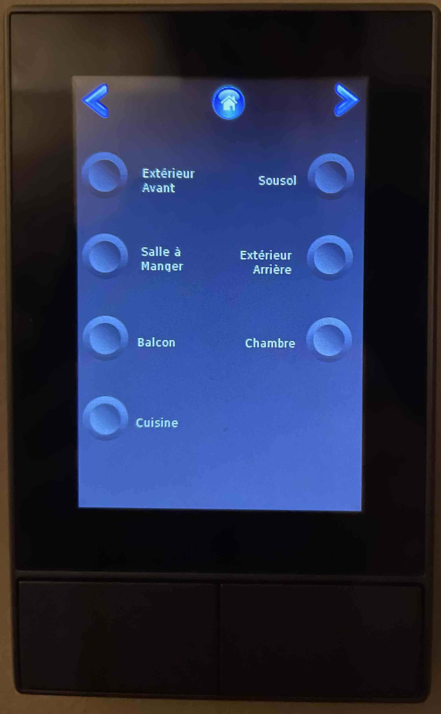
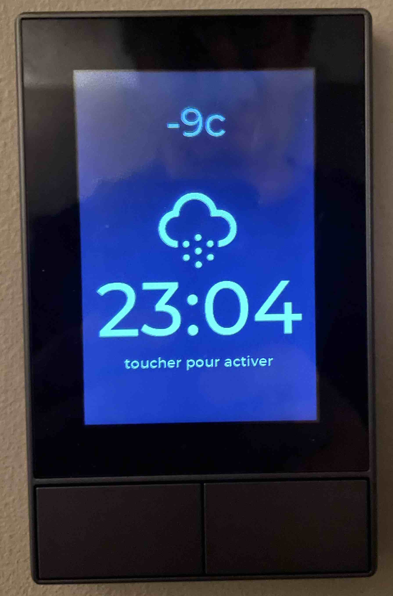
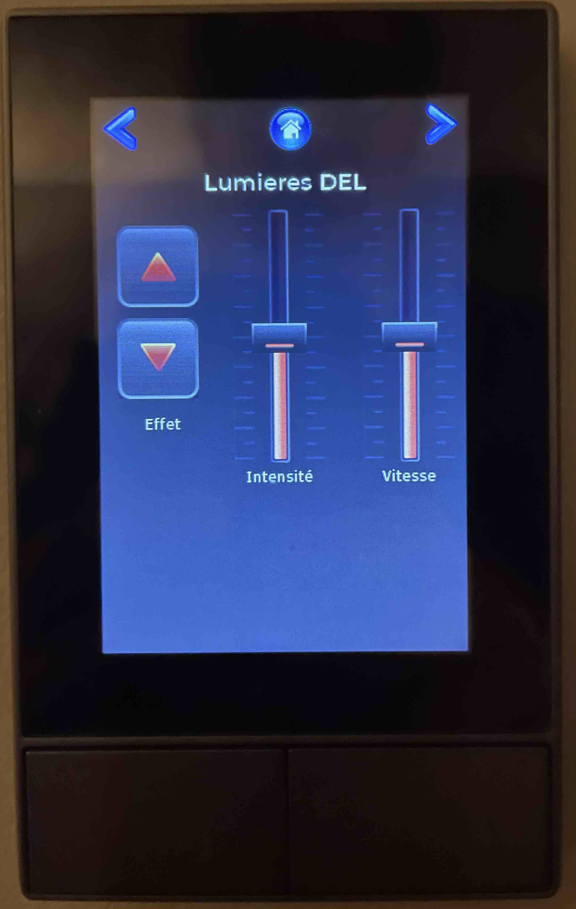
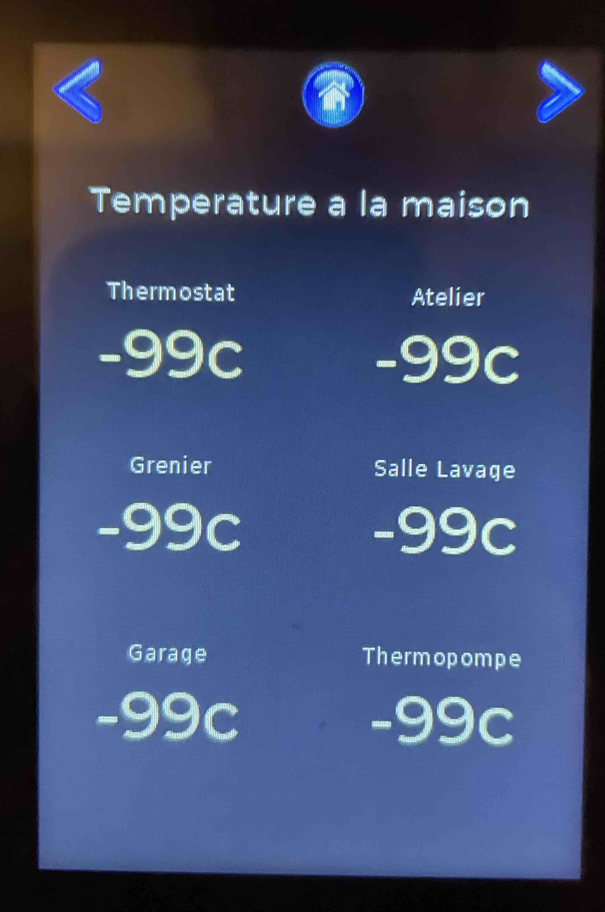
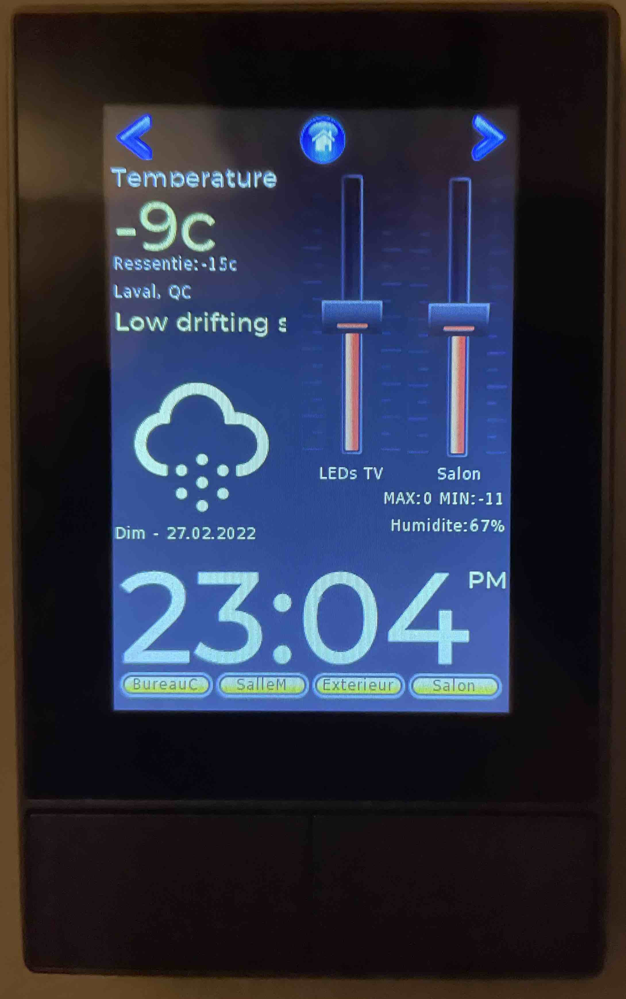
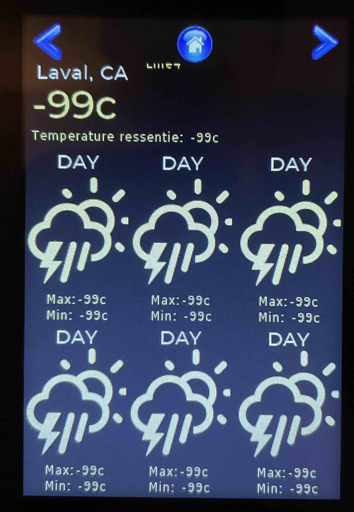

# nspanel
Custom nextion projet for using with sonoff nspanel and tasmota.
The berry script only updates the time. All other information is pushed via via MQTT messages to the .../cmnd/Nextion topic in the form of: pagename.object.txt="value"

Because i already have a NodeRed serveur to control all devices at home i found easier to implement the intelligence on a nodered flow rather than a berry script; Nodered is much more powerful.

Here are some examples:

